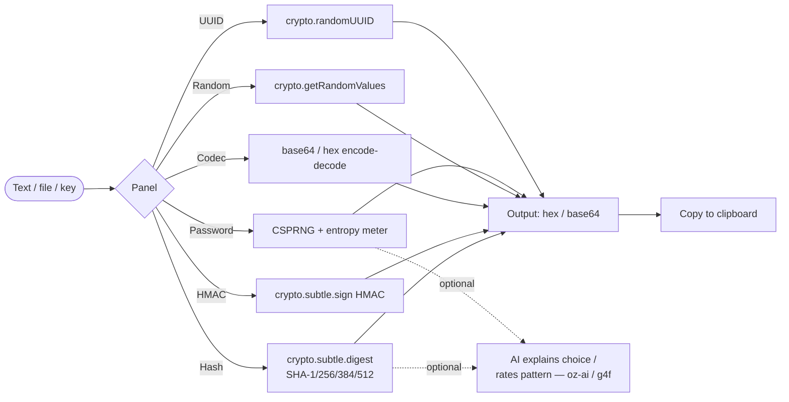

# oriz Hash

> The vault — a client-side crypto & hash toolkit. SHA-1/256/384/512, HMAC, base64/hex, secure random bytes, a password generator, and UUID v4. No upload, no signup.

[](./LICENSE)
[](https://github.com/chirag127/oriz-hash/stargazers)
[](https://github.com/chirag127/oriz-hash/commits/main)
[](https://github.com/chirag127/oriz-hash/actions/workflows/deploy.yml)
[](https://astro.build)

## What it is / why it exists

You often need a quick hash, an HMAC, a base64 decode, or some secure random bytes — and reaching for an online tool means pasting data into a stranger's server. That's exactly the wrong move for anything sensitive. **oriz Hash** does all of it with the browser's native Web Crypto API: every byte is processed locally and nothing is ever sent anywhere. It's the crypto Swiss-army knife you can trust because there's no backend to trust.

## Links

- **Live app:** https://hash.oriz.in
- **Info / landing page:** https://chirag127.github.io/oriz-hash/
- **Repo:** https://github.com/chirag127/oriz-hash
- **llms.txt:** https://hash.oriz.in/llms.txt

⭐ If this is useful, please **star the repo** — it helps others find it.

## How it works



All computation uses native `crypto.subtle` / `crypto.getRandomValues` / `crypto.randomUUID` — zero external crypto dependencies. The AI path is optional and never sees your secret (it assesses a password *pattern*, not the value). If AI is down, every core tool still works.

## Features

- **Hash** — SHA-256 (default), SHA-512, SHA-384, and legacy SHA-1, of text or any dropped file. Hex or base64 output. (SHA-1 is flagged as broken-for-collisions — checksums only.)
- **HMAC** — keyed MAC over a message; key as text/hex/base64, any SHA algorithm.
- **Base64 / Hex codec** — encode & decode both ways, including hex↔base64 and URL-safe base64.
- **Random bytes** — cryptographically secure (`crypto.getRandomValues`), output as hex + base64.
- **Password generator** — CSPRNG, tunable character sets, no-look-alike option, live entropy-based strength meter.
- **UUID v4** — via `crypto.randomUUID`.
- **AI polish (optional)** — explains hash-algorithm trade-offs and rates a password *pattern* (never the secret itself).
- **No upload, no signup, no analytics, free** — everything runs in-browser.

## Tech stack

- **[Astro](https://astro.build)** (static) — zero-JS-by-default shell
- **React 19** islands for each panel
- **Tailwind CSS v4** via `@tailwindcss/vite`
- **Native Web Crypto** — `crypto.subtle`, `crypto.getRandomValues`, `crypto.randomUUID` (no crypto libraries bundled)
- **[@vite-pwa/astro](https://github.com/vite-pwa/astro)** — installable, offline-capable PWA
- **Shared `@chirag127/*` packages** — `oz-ai` (keyless client-side AI over g4f/gpt4free with multi-provider failover, no API key), `oz-chrome`, `oz-file`, `oz-tokens-base`
- **Fonts:** JetBrains Mono + Space Grotesk (variable, self-hosted via Fontsource)

## Repo structure

```
oriz-hash/
├── src/
│   ├── components/
│   │   ├── Vault.tsx          # root island wiring the panels together
│   │   ├── HashPanel.tsx      # SHA-1/256/384/512
│   │   ├── HmacPanel.tsx      # keyed MAC
│   │   ├── CodecPanel.tsx     # base64 / hex
│   │   ├── RandomPanel.tsx    # secure random bytes + UUID
│   │   └── Digest.tsx         # output display
│   ├── lib/
│   │   ├── crypto.ts          # hash / HMAC / random / UUID (Web Crypto)
│   │   ├── codec.ts           # base64 / hex conversions
│   │   └── password.ts        # CSPRNG password gen + entropy
│   ├── layouts/Layout.astro
│   ├── pages/index.astro
│   ├── pwa.ts
│   └── styles/                # theme.css, vault.css
├── public/                    # favicon, icons, screenshots, llms.txt, robots.txt
├── gh-info/                   # GitHub Pages info/landing page source
├── PWABUILDER.md              # Android/store packaging notes
└── .github/workflows/         # deploy.yml, gh-pages-info.yml
```

## Quick start

```bash
npm install          # Windows: append --legacy-peer-deps (pnpm skips @esbuild/win32-x64)
npm run dev          # local dev server
npm run build        # static build → dist/
npm test             # vitest — codec, password, crypto vectors
npm run deploy       # astro build && wrangler pages deploy (Cloudflare Pages)
```

## Configuration

**No configuration required.** This is a fully client-side tool. The optional AI polish works keyless via `@chirag127/oz-ai` (g4f multi-provider failover) — no API keys are needed or committed.

## PWA

oriz Hash is an installable PWA (`@vite-pwa/astro`) and works offline after first load. It can be packaged for the Play Store / app stores via [PWABuilder](https://www.pwabuilder.com) — see [`PWABUILDER.md`](./PWABUILDER.md).

## Screenshots

_Desktop and mobile screenshots live in [`public/screenshots/`](./public/screenshots/) and are wired into the PWA manifest._

## Part of the oriz family

oriz Hash is one of ~80 small, fast, client-side tools in the **oriz** family. See how the fleet is built and why at **https://blog.oriz.in**.

## Cost

**$0 on the Cloudflare free tier** — static hosting, no backend, no database.

## Contributing

Issues and PRs welcome. Keep all cryptography on native Web Crypto, keep it client-side, and never log or transmit secrets. Tests run with `npm test`.

## License

[MIT](./LICENSE) © Chirag Singhal

## Author

Chirag Singhal · chirag@oriz.in

## Status & roadmap

Stable and in active use. Ideas: file checksum verification (compare against a known digest), CRC32, more codec formats.

## Changelog

Conventional commits are the changelog.
